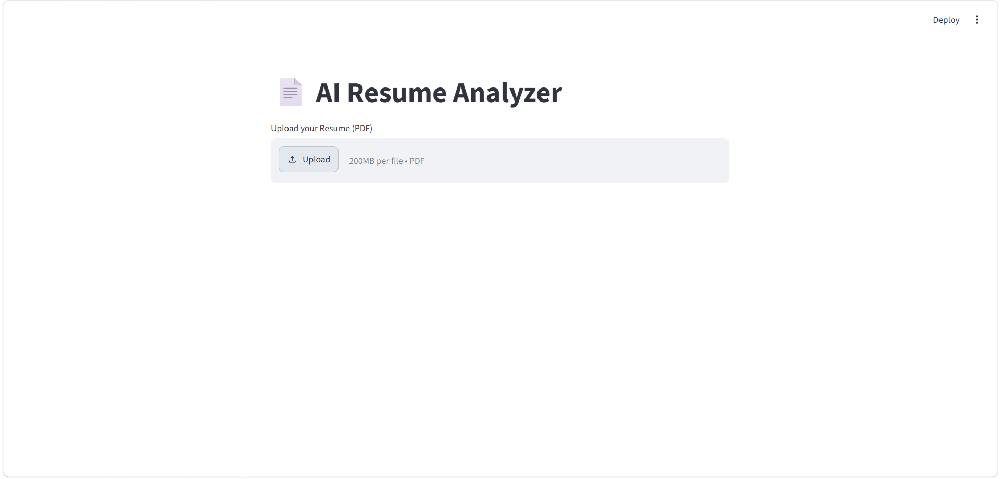
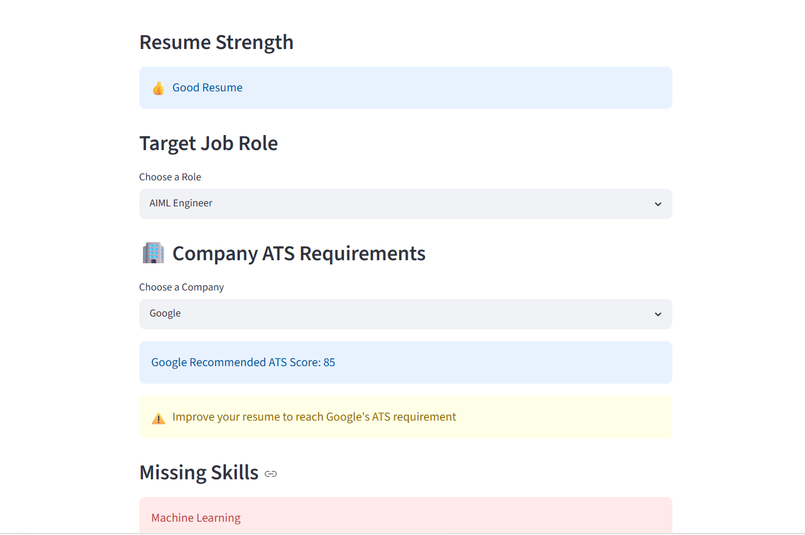

<p align="center">
  
</p>

<p align="center">
  
</p>

<h1 align="center">AI Resume Analyzer</h1>

<p align="center">
An AI-powered Resume Analyzer built using Python and Streamlit to evaluate resumes, calculate ATS scores, identify skills, and improve placement readiness.
</p>

<p align="center">
  
  
  
  
</p>

---

# 📖 About

AI Resume Analyzer is a web application developed using **Python** and **Streamlit**. It helps students and job seekers analyze their resumes by extracting text from PDF files, identifying technical skills, calculating an ATS (Applicant Tracking System) score, checking resume sections, comparing resumes against job roles and company requirements, recommending learning resources, and predicting placement readiness.

---

# ✨ Features

- 📄 Resume PDF Upload
- 📝 Automatic Resume Text Extraction
- 🤖 AI-Based Skill Detection
- 📊 ATS Score Calculation
- 📈 Resume Match Percentage
- 👨‍💻 Role-Based Skill Analysis
- 🏢 Company-Wise ATS Requirement Check
- ❌ Missing Skill Identification
- 📚 Personalized Learning Recommendations
- 📉 Skill Gap Analysis
- 📥 Download Resume Analysis Report
- ✅ Placement Readiness Prediction

---

# 📸 Project Preview

## 🏠 Home Page

<p align="center">
  
</p>

## 📄 Resume Analysis

<p align="center">
  
</p>

---

# 🛠 Tech Stack

| Category | Technology |
|-----------|------------|
| Programming Language | Python |
| Framework | Streamlit |
| PDF Processing | pdfplumber |
| Data Processing | Pandas |
| Numerical Computing | NumPy |
| Machine Learning | scikit-learn |
| Natural Language Processing | spaCy |
| Data Visualization | Matplotlib |
| Version Control | Git & GitHub |
| IDE | Visual Studio Code |

---

# 📂 Project Structure

```text
AI_Resume_Analyzer
│
├── assets/
│   ├── banner.png
│   ├── logo.png
│   └── screenshots/
│       ├── home.png
│       └── result.png
│
├── data/
├── styles/
├── utils/
├── app.py
├── requirements.txt
├── README.md
└── LICENSE
```

---

# ⚙️ Installation

Clone the repository:

```bash
git clone https://github.com/Rishineon/AI-Resume-Analyzer.git
```

Move into the project folder:

```bash
cd AI-Resume-Analyzer
```

Install the required packages:

```bash
pip install -r requirements.txt
```

Run the application:

```bash
streamlit run app.py
```

---

# 🚀 How It Works

1. Upload a PDF resume.
2. Extract text from the resume.
3. Detect technical skills.
4. Calculate the ATS score.
5. Compare with the selected job role.
6. Check company-specific ATS requirements.
7. Recommend missing skills and learning resources.
8. Predict placement readiness.
9. Download the resume analysis report.

---

# 📊 ATS Score Criteria

| Section | Weight |
|----------|--------|
| Skills | 40% |
| Projects | 20% |
| Experience | 20% |
| Certifications | 10% |
| Education | 10% |

---

# 👨‍💻 Supported Job Roles

- AIML Engineer
- Data Scientist
- Data Analyst
- Business Analyst

---

# 🏢 Supported Companies

- Google
- Amazon
- Microsoft
- IBM
- Capgemini
- Infosys
- TCS

---

# 🔮 Future Enhancements

- Multi-language Resume Analysis
- AI Resume Builder
- Resume Ranking System
- Recruiter Dashboard
- Cloud Deployment
- User Authentication

---

# 🤝 Contributing

Contributions are welcome.

1. Fork this repository.
2. Create a new branch.
3. Commit your changes.
4. Push your branch.
5. Open a Pull Request.

---

# 📜 License

This project is licensed under the MIT License.

---

# 👨‍💻 Author

**Rishi Kumar S Nair**

B.Tech Computer Science Engineering (AI & ML)

Jain (Deemed-to-be University)

GitHub: https://github.com/Rishineon

---

<p align="center">
⭐ If you found this project useful, consider giving it a star on GitHub.
</p>