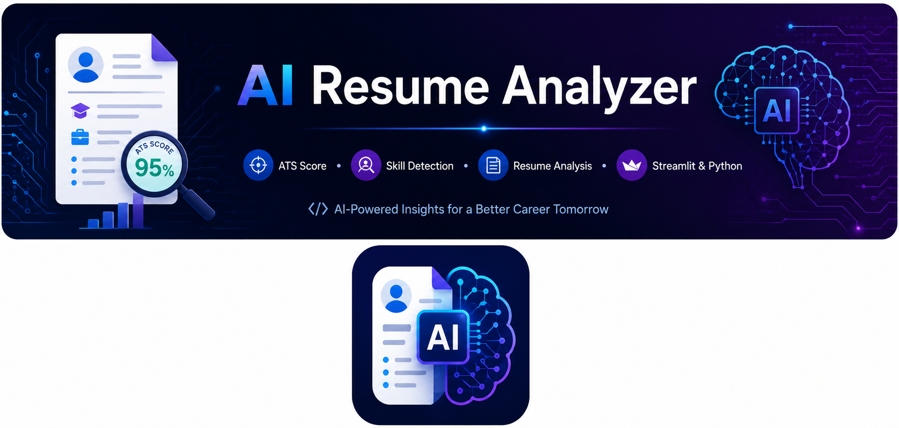
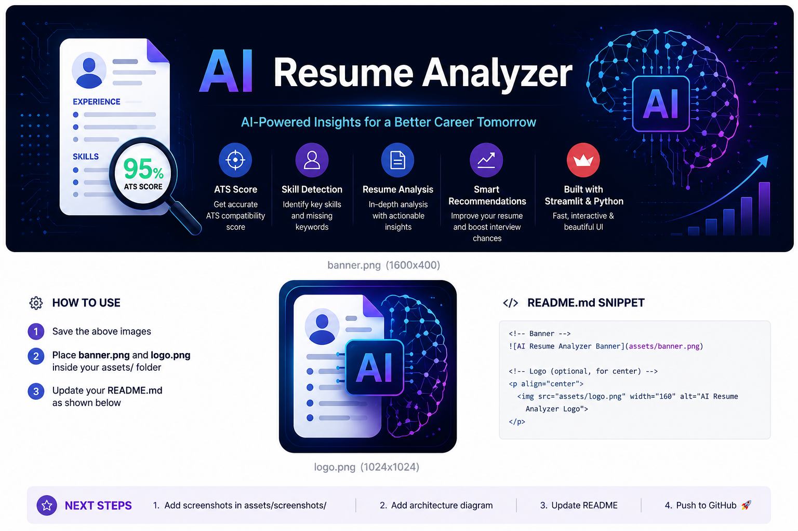


<p align="center">
  
</p>

<p align="center">
  
</p>

<h1 align="center">AI Resume Analyzer</h1>

<p align="center">
AI-powered Resume Analyzer using Streamlit & Python
</p>

<br>

<p align="center">
  
  
  
  
  
</p>

<br>

---

An AI-powered Resume Analyzer built using **Python** and **Streamlit** that evaluates resumes, calculates ATS scores, detects skills, analyzes resume sections, provides personalized learning recommendations, and measures placement readiness.

---
## 🚀 Features

- 📂 Upload Resume (PDF)
- 📑 Extract Resume Text
- 🧠 Automatic Skill Detection
- 📊 ATS Score Calculation
- 📈 Resume Match Percentage
- 🏢 Company-wise ATS Requirements
- 💼 Role-based Skill Analysis
- 🎯 Missing Skill Identification
- 📚 Personalized Learning Recommendations
- 📥 Download Resume Analysis Report
- 📉 Skill Gap Analysis
- 🎯 Placement Readiness Prediction
---

# 🎨 Frontend

### Technologies Used

- Streamlit
- HTML (via Streamlit Components)
- CSS
- Python

### Frontend Features

- Interactive Dashboard
- Resume Upload Interface
- ATS Score Dashboard
- Resume Match Visualization
- Skill Gap Analysis Charts
- Download Report Button
---

# ⚙️ Backend

### Technologies Used

- Python
- pdfplumber
- Matplotlib
- Streamlit

### Backend Features

- PDF Resume Parsing
- Resume Text Extraction
- Skill Detection
- AI Suggestions
- Download Report

- ---

## 🎨 Frontend

The frontend is built using **Streamlit** to provide an interactive and user-friendly interface.

### Technologies Used
- Streamlit
- HTML (via Streamlit)
- CSS (Custom Styling)

### Features
- Resume Upload
- ATS Score Display
- Interactive Dashboard
- Resume Analysis Results
- Responsive User Interface

---

## ⚙️ Backend

The backend is developed using **Python** and performs resume parsing and AI-based analysis.

### Technologies Used
- Python
- Streamlit
- PyPDF2
- pdfplumber
- spaCy
- scikit-learn
- Pandas
- NumPy

### Features
- Resume Text Extraction
- Skill Extraction
- Keyword Matching
- ATS Score Calculation
- Resume Analysis
- Job Recommendation
- Data Processing

## Installation

pip install -r requirements.txt

streamlit run app.py

## Author

Rishi Kumar

- ATS Score Calculation
- Resume Match Calculation
- Company-wise ATS Analysis
- Learning Recommendation Engine
- Placement Readiness Analysis
---

# 💻 Tech Stack

| Technology | Purpose |
|------------|---------|
| Python | Backend Development |
| Streamlit | Frontend UI |
| pdfplumber | Resume Parsing |
| Matplotlib | Data Visualization |
| Git | Version Control |
| GitHub | Project Hosting |
---

# 📂 Project Structure

```text
AI_RESUME_ANALYZER
│
├── assets
│   └── screenshots
│
├── data
│   ├── courses.csv
│   ├── keywords.csv
│   └── skills.csv
│
├── styles
│   └── style.css
│
├── utils
│   ├── parser.py
│   ├── ats_score.py
│   ├── recommendation.py
│   └── skill_extractor.py
│
├── app.py
├── config.py
├── README.md
├── requirements.txt
├── LICENSE
└── .gitignore
```